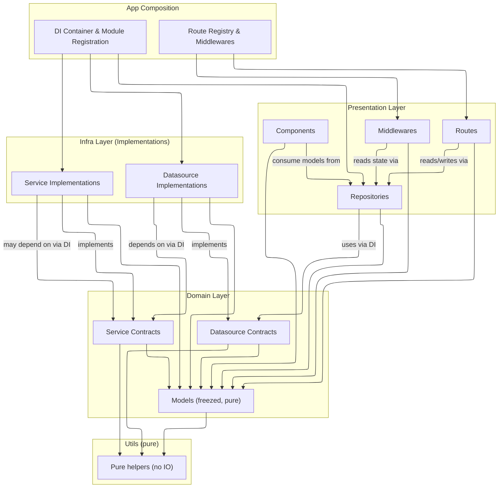

# Modular Foundation

A pragmatic, testable, and highly modular architecture for Flutter apps. It formalizes clean boundaries between **Presentation**, **Domain**, **Infra**, and **Utils**, with strong DI conventions and repository‑driven UI state.

> [!IMPORTANT]  
> This is a **work in progress**. The architecture is stable, but the API and documentation are still evolving and subject to change. Feedback and contributions are welcome!

## Motivation

Unclear ownership of IO vs UI, repositories doing too much, infra types leaking into presentation, and cross‑module coupling that made refactors painful. The Modular Foundation draws a hard line between concerns so features stay swappable and tests stay fast. It’s inspired by ideas popularized in **flutter_modular** (composition by modules, explicit routing/DI boundaries), adapted to emphasize **contracts-first domain design** and **repository‑driven state**.

## Overview

* **Predictable boundaries**: Presentation never touches IO; Infra never leaks types outward.
* **Easy to test**: Contracts and pure models enable stable test surfaces.
* **Replaceable implementations**: Swap HTTP clients, storage, or crypto without touching UI.
* **Scalable modules**: Each app feature is a self‑contained module with its own domain/infra/presentation wiring.

## Folder Layout

```txt
lib/
└─ src/
   ├─ app/
   │  ├─ domain/
   │  │  ├─ datasources/        # abstract datasource contracts (no IO, no SDKs)
   │  │  │  ├─ datasources.dart # barrel export
   │  │  ├─ models/             # pure, immutable DTOs/entities (freezed)
   │  │  │  ├─ models.dart      # barrel export
   │  │  ├─ services/           # abstract service contracts (time/crypto/token/etc.)
   │  │  │  ├─ services.dart    # barrel export
   │  │  └─ domain.dart         # re-exports, type aliases, common errors
   │  ├─ infra/
   │  │  ├─ datasources/        # concrete datasource impls (http/db/fs/etc.)
   │  │  │  ├─ datasources.dart # barrel export
   │  │  ├─ services/           # concrete service impls (e.g., JwtServiceImpl)
   │  │  │  ├─ services.dart    # barrel export
   │  │  └─ infra.dart          # DI registrations for this module
   │  ├─ presentation/
   │  │  ├─ middlewares/        # route middlewares (depend on repos/models)
   │  │  ├─ repositories/       # UI-facing repos (bindable state + CRUD)
   │  │  ├─ routes/
   │  │  │  └─ routes.dart      # barrel export
   │  │  └─ components/         # shared UI components used by routes
   │  ├─ utils/
   │  │  ├─ utils.dart          # pure helpers; no side effects, no framework deps
   │  └─ app.dart               # app composition; global DI & route registry
   └─ ... other modules/
```

## Layers at a Glance

### Presentation

Components, Routes, Repositories, Middlewares. UI‑facing state & commands only.

#### Repositories

* Provide **bindable state** and **UI‑friendly actions** (CRUD / filter / sort) for routes/components.
* Depend on injected **domain** datasource contracts (+ models). No infra imports, no direct IO.
* Handle pagination, debounced search, optimistic updates, retries; expose typed state and simple methods.

##### Repository should

* Expose a **readonly** state stream/value.
* Encapsulate **loading / error** states.
* Provide **idempotent** operations and **retry** helpers.

#### Middlewares

* Depend only on **repositories** and **domain models**.
* Evaluate access / ready‑state and redirect via router. No direct IO.
* Typical uses: auth guard, feature readiness, data preloading checks.

#### Domain

Contracts (datasources & services) + pure immutable models.

* **Can depend on**: domain models, pure utils.
* **Cannot depend on**: infra, presentation, platform APIs, or any IO.
* **Contracts** reference **only domain models** (no Flutter/HTTP types).
* **Models** are immutable (e.g., `freezed`) and serialization is defined here.

#### Infra

Implementations of domain contracts (HTTP/DB/FS/etc.) + service implementations.

* **Datasource impls** implement domain datasource contracts; may call HTTP/DB/FS; may depend on **service contracts** via DI; return **domain models** only.
* **Service impls** implement domain service contracts; may depend on other **service contracts** via DI.
* **No infra type leaks**: never export SDK/HTTP types outside infra; map to domain models at the boundary.

### Utils

* Pure, side‑effect‑free helpers; can be used anywhere.
* No imports from framework, platform channels, or IO.

## Composition & DI

* Each **module** registers infra implementations to **domain contracts** in `infra.dart`.
* The **app module** composes global/common services & datasources, wires the **route registry** and **middlewares**, and aggregates module DI.
* **Cross‑module usage**: import another module’s **domain** (contracts/models) and resolve via DI. Never import another module’s **infra**.

### DI Checklist

* Register every infra implementation against its domain contract.
* Keep DI modules small and per‑feature.
* Inject **contracts**, not concrete infra types.
* Prefer factories for stateful dependencies; singletons for stateless, pure services.

## Testing Guidance

### What to test

* **Domain**: pure unit tests for models, contracts, and policies.
* **Infra**: contract test suites—run impls against shared tests defined by the domain contracts.
* **Presentation**: repo tests with mocked contracts; route/component tests bind repos via providers/DI.

### Suggested Test Structure

```txt
/test
  /domain
  /infra
  /presentation
```

## Cross‑Module Usage Rules

* Import **domain** (contracts/models) across modules.
* Resolve implementations via DI.
* Never import another module’s **infra** or **presentation**.

## Coding Conventions

### Naming

* **Always end names with the layer & type**: `MyRepo`, `MyService`, `MyDatasource`.
* **Infra concretes** must start with the **key differentiator**, then the **contract**, then the **type**. Examples:

  * `DioNetworkService`, `HttpNetworkService`, `GraphQlApiService`, `RestApiService`
  * `LocalUserDatasource`, `OpenIdUserDatasource`
* **Contracts vs. implementations**:

  * Contract: `NetworkService`, `UserDatasource`
  * Infra implementation: `RestApiService`, `OpenIdUserDatasource`

### Barrels & Errors

* Barrels: `models.dart`, `datasources.dart`, `services.dart` re‑export public surfaces.
* Errors: domain‑level failures are typed (e.g., sealed classes) and never leak SDK exceptions.
* Routing: routes live under `presentation/routes`, registered centrally in `app.dart`.

## Lifecycle & Data Flow



## FAQ

**Can a repository call platform APIs?**
No. Repositories depend only on **domain contracts** and **models**.

**Where do JSON mappers live?**
In the **domain models**; infra converts from SDK/HTTP to domain models at boundaries.

**Can infra call other infra implementations directly?**
Use **service contracts** via DI. Avoid new‑ing concrete infra from infra.

**How do I share types across modules?**
Export them from the **domain** (`models.dart`, `datasources.dart`, `services.dart`).

## License

MIT License. See [LICENSE](LICENSE) file for details.
